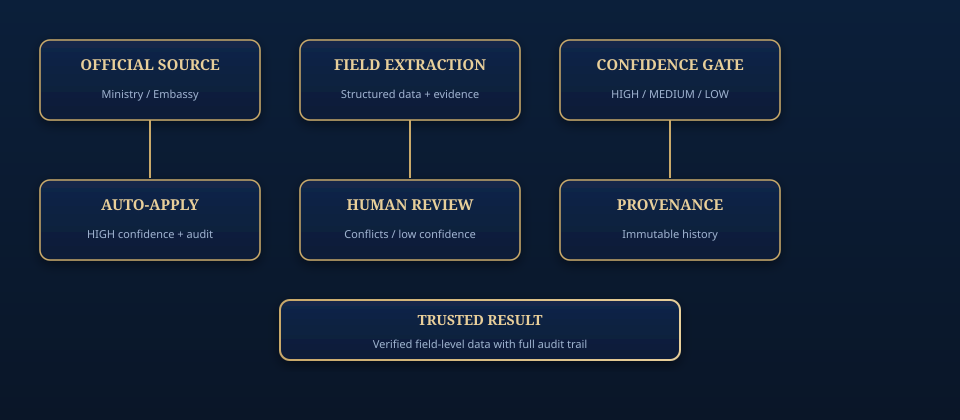
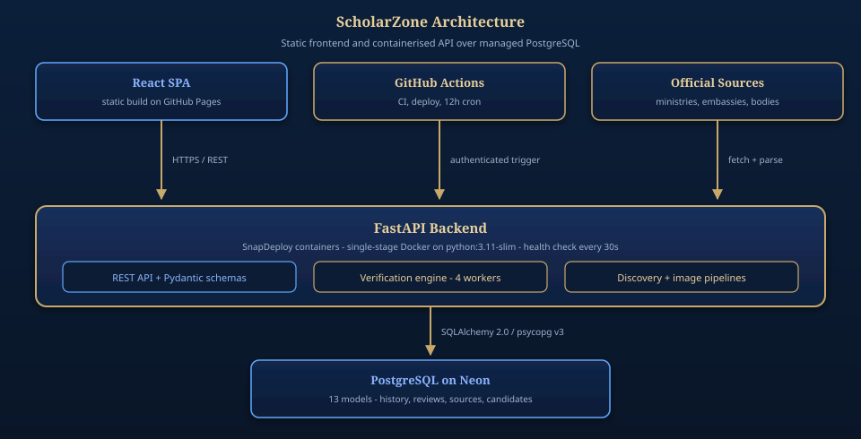
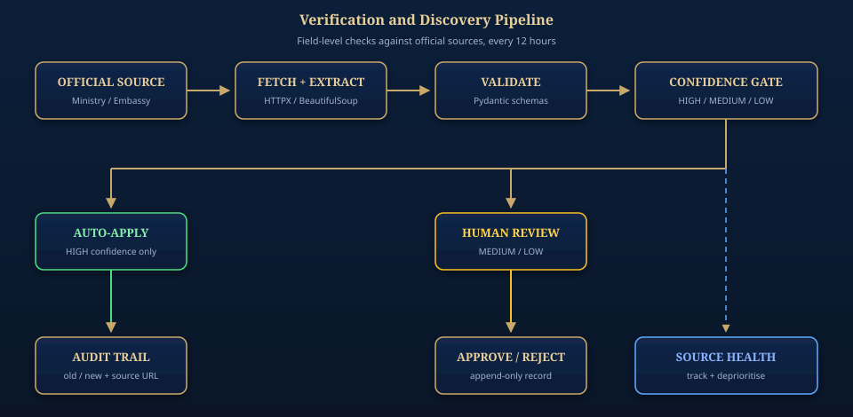
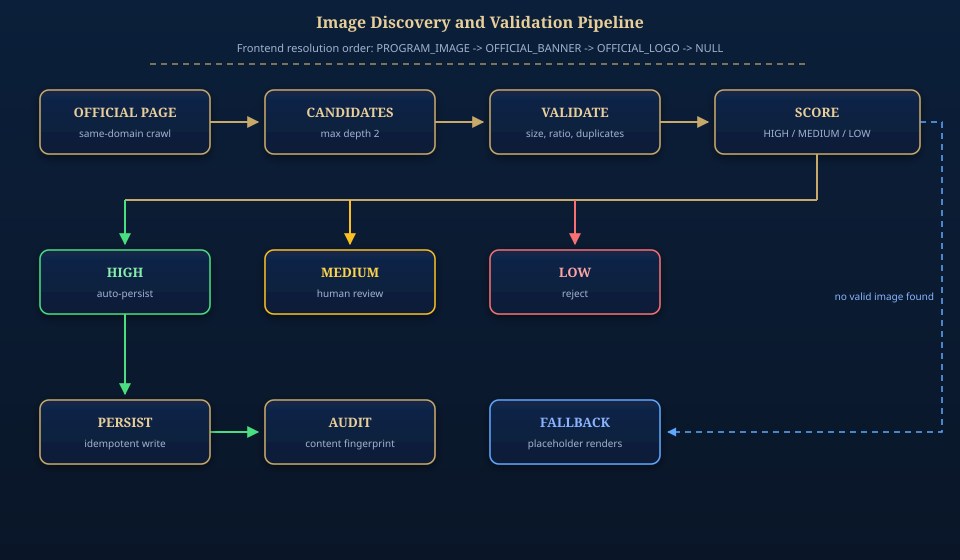
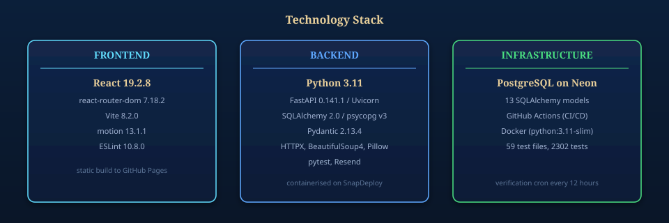

<div align="center">

# ScholarZone

### Verified Scholarships. Trusted Information. Better Decisions.



**ScholarZone discovers, verifies, and maintains scholarship data from official sources — with field-level provenance, immutable audit history, and human review wherever confidence is low.**

[Repository](https://github.com/gopal735/ScholarZone) · [Report an Issue](https://github.com/gopal735/ScholarZone/issues) · [API Reference](#api-reference) · [Deployment](#deployment)

</div>

---

## Contents

- [Overview](#overview)
- [Why ScholarZone](#why-scholarzone)
- [Dataset Snapshot](#dataset-snapshot)
- [Architecture](#architecture)
- [Verification Pipeline](#verification-pipeline)
- [Image Pipeline](#image-pipeline)
- [Trust Model](#trust-model)
- [Technology](#technology)
- [Features](#features)
- [Engineering](#engineering)
- [API Reference](#api-reference)
- [Local Development](#local-development)
- [Configuration](#configuration)
- [Repository Structure](#repository-structure)
- [Deployment](#deployment)
- [Project Status](#project-status)
- [Roadmap](#roadmap)
- [Contributing](#contributing)
- [License](#license)

---

## Overview

Finding a scholarship usually means reading dozens of unmaintained pages, guessing which figures are still current, and discovering too late that a deadline or a link has changed. Most aggregators copy listings wholesale, so an error introduced once keeps propagating.

ScholarZone treats every listing as a claim that has to be re-checked against its primary source, on a schedule, field by field.

The platform is two services:

- **Frontend** — a React single-page application for browsing, filtering, comparing, and shortlisting opportunities.
- **Backend** — a FastAPI service exposing a REST API, an autonomous verification engine, a discovery pipeline, and an admin review dashboard.

What makes it different is the maintenance model rather than the interface: listings are not static rows, they are continuously re-validated records with a full history of what changed, when, and against which source URL.

---

## Why ScholarZone

| Principle | What it means in practice |
| :--- | :--- |
| **Source-first** | Opportunities are ranked by primary official sources, not third-party aggregators that copy from each other. |
| **Field-level verification** | Each field is checked independently against the official page, so one bad value does not invalidate an entire listing. |
| **Immutable audit trail** | Every applied change is recorded with old value, new value, source URL, confidence, and timestamp. |
| **Human in the loop** | Identity conflicts, low-confidence findings, and third-party sources are routed to review instead of being applied silently. |
| **Scheduled maintenance** | Verification runs on a fixed 12-hour cycle, so listings decay slowly rather than rotting between manual checks. |
| **Honest imagery** | Images are discovered only where they exist officially, and never fabricated to fill a gap. |

---

## Dataset Snapshot

The figures below are a **local snapshot taken from a development database**, not a service-level guarantee. Counts change as discovery, verification, and lifecycle transitions run.

| Metric | Snapshot value |
| :--- | ---: |
| Scholarships | 487 |
| Countries represented | 29 |
| Verification history rows | 209 |
| Reviews | 859 |
| Discovery candidates (pending) | 17 |
| Approved sources | 20 |

---

## Architecture



Three tiers, deployed independently:

| Tier | Technology | Hosting |
| :--- | :--- | :--- |
| Frontend | React 19 + Vite, static build | GitHub Pages |
| Backend | FastAPI, Python 3.11, Docker (`python:3.11-slim`) | SnapDeploy containers |
| Database | PostgreSQL (Neon), 13 SQLAlchemy models | Neon |

Automation sits alongside them: GitHub Actions runs backend tests and frontend lint on every push, deploys the frontend, verifies the production backend, and triggers the 12-hour verification cycle.

### Data model

Thirteen models back the platform. The load-bearing ones:

| Model | Role |
| :--- | :--- |
| `Scholarship` | Core record, with verification status and next-due date |
| `ScholarshipVerificationHistory` | Append-only record of every applied field change |
| `ScholarshipReview` | Human review queue with approve / reject outcome |
| `ApprovedSource` | Registry of official sources cleared for crawling |
| `SourceHealth` | Per-source success and failure counts |
| `DiscoveryCandidate` | Newly found opportunities awaiting review |
| `ContentFingerprintRecord` | Idempotency and duplicate-detection ledger for images |
| `KnowledgeNode` / `KnowledgeEdge` | Knowledge-graph structures for relationship exploration |

<details>
<summary>Remaining models</summary>

`ScholarshipFetchAttempt`, `ScholarshipSnapshot`, `ImageReview`, `ScholarshipRestoreRecord`.

</details>

---

## Verification Pipeline



A scheduled job triggers a bounded run over due scholarships:

1. **Trigger** — GitHub Actions calls the authenticated `POST /internal/verify/trigger` endpoint.
2. **Authorise** — the request must carry the `X-Verification-Secret` header. Triggers are rate-limited to one per 60 seconds; rapid or concurrent requests receive `429`.
3. **Schedule** — `SchedulerEngine` runs a bounded `ThreadPoolExecutor` with 4 workers over a batch, then shuts down cleanly.
4. **Fetch and extract** — each candidate's official page is retrieved and parsed into structured fields with evidence attached.
5. **Diff** — extracted values are compared field by field against the stored record.
6. **Gate** — the confidence assigned to each field decides the outcome.
7. **Persist** — approved changes are written together with their history row.

### Confidence levels

| Level | Meaning | Outcome |
| :--- | :--- | :--- |
| `HIGH` | Field matches the official source | Applied automatically |
| `MEDIUM` | Partial match | Recorded, flagged for review |
| `LOW` | Weak or conflicting evidence | Routed to human review |
| `HUMAN_REVIEW` | Requires an explicit decision | Held until reviewed |

Fatal signals are handled distinctly: a `401` or `404` on the health endpoint is a configuration error and fails the run immediately, while `403` (edge block), `503` (cold start or database not ready), and connection failures are treated as transient and retried.

### Cold-start handling

Production runs on containers that scale to zero, so the first request after an idle period pays the wake-up cost. The workflow probes `/health` on a backoff schedule of **10s, 20s, 30s, 45s, 60s, 90s, 120s, 120s, 180s** — a 675-second total budget — and verifies readiness after the final sleep before declaring the budget exhausted. The verification trigger is only sent once readiness is confirmed, so a request is never fired into a container that is still booting.

Country-level discovery runs after each successful round, recording candidates for review and transitioning listings through `active` / `needs_review` / `inactive`.

---

## Image Pipeline



Most listings have no official artwork, and inventing some would misrepresent the source. ScholarZone only uses imagery that genuinely exists on the official domain.

**Resolution order:** `PROGRAM_IMAGE` → `OFFICIAL_BANNER` → `OFFICIAL_LOGO` → `NULL`, with the frontend rendering a clean placeholder when nothing valid exists.

### Validation layers

- **Non-content rejection** — filters banners, placeholders, logos, social icons, and Open Graph thumbnails.
- **Dimension floors** — minimum 200px, with a 500px minimum for cover imagery.
- **Aspect ratio** — rejects anything outside a 0.2 to 5.0 ratio.
- **Duplicate detection** — rejects near-duplicate images across listings.
- **Official-domain check** — the candidate must originate from the scholarship's own official domain.

### Outcome by confidence

| Confidence | Action |
| :--- | :--- |
| `HIGH` | Persisted automatically via `POST /internal/images/verify`, with an idempotent fingerprint record |
| `MEDIUM` | Held for human review |
| `LOW` | Rejected |

Verified images are never silently overwritten by a lower-confidence candidate.

---

## Trust Model

Provenance is the point of the system, so it is enforced at four levels:

- **Official-domain checking** — a listing is only considered verified against a source cleared in `ApprovedSource`, and images must come from that same domain.
- **Per-field evidence** — every applied value carries the source URL it was derived from, not just a record-level link.
- **Append-only history** — `ScholarshipVerificationHistory` records old value, new value, source, confidence, and timestamp. History rows are written, never updated.
- **Idempotency** — fingerprint records and rate limits prevent duplicate application of the same change or image.

`SourceHealth` tracks per-source success and failure counts, allowing sources that repeatedly fail to be deprioritised in discovery rather than retried indefinitely.

---

## Technology



| Layer | Technology | Version |
| :--- | :--- | :--- |
| UI | React | 19.2.8 |
| Routing | react-router-dom | 7.18.2 |
| Build | Vite | 8.2.0 |
| Animation | motion | 13.1.1 |
| Linting | ESLint | 10.8.0 |
| Runtime | Python | 3.11 |
| API | FastAPI | 0.141.1 |
| ASGI server | Uvicorn | 0.52.1 |
| ORM | SQLAlchemy | 2.0 |
| Driver | psycopg | v3 |
| Validation | Pydantic | 2.13.4 |
| HTTP client | HTTPX | >=0.27 |
| Parsing | BeautifulSoup4 | latest |
| Imaging | Pillow | latest |
| Email | Resend | latest |
| Tests | pytest | latest |
| Database | PostgreSQL (Neon) | managed |
| Containers | Docker (`python:3.11-slim`) | single-stage |

---

## Features

### Discovery and exploration
Country-level discovery finds candidate opportunities from approved official sources and records them as `DiscoveryCandidate` rows for review. A country explorer shows live per-country counts alongside destination cards. Listings can be filtered by country, degree, funding type, deadline month, and status, and sorted by recommendation, recency, deadline, funding, or name.

### Verification
Field-level verification with `active` / `needs_review` / `inactive` status, last-verified timestamps, and next-due scheduling. An append-only history records every applied change, and conflicts route into a review queue with approve and reject actions.

### Image discovery
Same-domain crawling to a maximum depth of 2, context-aware candidate extraction, layered validation, confidence scoring, and idempotent persistence for approved imagery.

### Reviews and provenance
Every verified value is traceable to the source URL it came from. A review workflow captures human decisions on uncertain fields as durable records rather than transient state.

### Comparison and shortlisting
Up to four scholarships can be compared side by side on country, degree, funding, and deadline. Saved scholarships are stored device-locally, with no account required.

### Scheduled automation
A 12-hour cron cycle wakes the backend, runs verification, and triggers discovery, with concurrency control to prevent overlapping rounds.

### Admin dashboard
A control surface for the verification queue, metric cards, search and filter, and verify and flag actions, backed by a dedicated image review interface.

---

## Engineering

### Test suite

- **59** test files under `backend/tests/`
- **2302** test functions

The suite exercises the verification engine, image validation and discovery, the discovery pipeline, lifecycle transitions, source health, schema compatibility, and API endpoints. The suite is **not** fully green: a known failure remains open and is tracked rather than suppressed. Treat the current state as *nearly passing*, not as a 100% pass claim.

### CI

`.github/workflows/ci.yml` runs on every push and covers:

- backend tests via pytest
- frontend lint via ESLint
- schema compatibility checks
- smoke tests against the running application

Frontend deployment, production backend verification, and the scheduled verification cycle each run in their own workflow.

---

## API Reference

The backend exposes a FastAPI application, **ScholarZone API** (version 1.0.0). Swagger documentation is available at `/docs` outside production only, and is disabled in production. ReDoc is always disabled.

Production base URL: `https://scholarzone-api-2ee2d.containers.snapdeploy.app`

| Method | Path | Purpose |
| :--- | :--- | :--- |
| `GET` | `/` | Welcome message |
| `GET` | `/health` | Health check — `200` when ready, `503` if the database is not |
| `GET` | `/scholarships` | List, filter, sort, and paginate scholarships |
| `GET` | `/scholarships/{id}` | Scholarship details |
| `POST` | `/internal/verify/trigger` | Trigger a verification round (authenticated) |
| `POST` | `/internal/discover/trigger` | Trigger country-level discovery (authenticated) |
| `POST` | `/internal/images/verify` | Persist verified images (authenticated) |
| `GET` | `/admin/queue` | Verification review queue |

All `/internal` endpoints require the `X-Verification-Secret` header to match the configured `SCHOLARZONE_VERIFICATION_SECRET`.

### Trigger responses

| Status | Meaning |
| :--- | :--- |
| `202` | Round accepted and running |
| `429` | Rate-limited; a round is already in progress or too recent |
| `401` / `403` | Authentication failure — the run fails |
| `503` | Service unavailable, typically cold start or database not ready |

---

## Local Development

### Prerequisites

- Python 3.11+
- Node.js 18+ and npm
- PostgreSQL, or SQLite for local development

### Backend

```bash
cd backend
pip install -r requirements.txt
cp .env.example .env
uvicorn app.main:app --reload --host 0.0.0.0 --port 8000
```

The API is then available at `http://localhost:8000`, with Swagger docs at `/docs`.

### Frontend

```bash
cd frontend
npm install
npm run dev
```

### Seeding

Outside production the database is seeded on startup from `data/verified_scholarships.py` (DAAD, ICCR, and curated entries). In production seeding is skipped and the database is populated by migration.

---

## Configuration

| Variable | Required | Description |
| :--- | :---: | :--- |
| `DATABASE_URL` | Yes | Database URL — PostgreSQL in production, SQLite in dev and test |
| `ENVIRONMENT` | Yes | `development`, `test`, or `production` |
| `SCHOLARZONE_VERIFICATION_SECRET` | Yes (production) | Shared secret for verification trigger endpoints |
| `VERIFICATION_SECRET` | Yes | Alias used by the verification router |
| `ALLOWED_ORIGINS` | No | Comma-separated CORS allowlist |
| `MIN_IMAGE_DIMENSION` | No | Minimum image dimension in pixels (default 200) |
| `MIN_COVER` | No | Minimum cover image dimension (default 500) |
| `NON_CONTENT_REJECTION_THRESHOLD` | No | Non-content scoring threshold (default 1.5) |
| `RESEND_API_KEY` | No | Resend API key for email delivery |
| `VITE_API_URL` | Frontend | Backend API base URL |

`config.py` rejects SQLite URLs when `ENVIRONMENT=production`, which keeps production pinned to PostgreSQL.

---

## Repository Structure

```
ScholarZone/
├── frontend/                     # React + Vite SPA
│   └── src/
│       ├── components/           # Reusable UI, including ScholarshipImage
│       ├── pages/                # Route-level pages
│       ├── hooks/                # Custom hooks
│       └── lib/                  # API client and utilities
├── backend/
│   ├── app/
│   │   ├── main.py               # FastAPI entry point
│   │   ├── models.py             # 13 SQLAlchemy models
│   │   ├── schemas.py            # Pydantic schemas
│   │   ├── routers/              # scholarships, verification, discovery, admin
│   │   ├── scheduler_v2.py       # Verification engine
│   │   └── services/             # Discovery, images, reviews, source health
│   ├── tests/                    # 59 test files, 2302 test functions
│   ├── Dockerfile                # Single-stage python:3.11-slim
│   ├── render.yaml               # Alternative deployment config, not production
│   └── requirements.txt
├── docs/                         # Product, design, API, and architecture docs
│   └── assets/                   # README diagrams
├── data/                         # Seed data (DAAD, ICCR, curated)
├── .github/workflows/            # ci, frontend, deploy, verification-cron
└── README.md
```

---

## Deployment

### Frontend

Built with `vite build` and published to GitHub Pages by `.github/workflows/frontend.yml`.

### Backend

Production runs on **SnapDeploy containers**, not Render. A `backend/render.yaml` file exists as an alternative deployment configuration, but it is not the active production platform. The container is a single-stage Docker build on `python:3.11-slim` with a health check every 30 seconds, and `.github/workflows/deploy.yml` verifies the production deployment after pushes.

### Database

PostgreSQL on Neon in production; SQLite for development and testing. Production databases are populated by migration rather than by seeding.

### Scheduled verification

`.github/workflows/verification-cron.yml` runs on `7 */12 * * *` — every 12 hours at minute 7. Rounds are grouped under a concurrency group with `cancel-in-progress` so overlapping runs cannot occur. The job validates configuration, wakes the container and triggers verification, then triggers discovery only if verification succeeded.

A legacy APScheduler instance exists in `scheduler_v2.py` but is intentionally **not started in production**, so verification is driven exclusively by the cloud cron job and duplicate scheduler execution cannot occur.

---

## Project Status

### Implemented

Scholarship browsing, filtering, sorting, and detail views; country explorer with live counts; side-by-side comparison of up to four scholarships; device-local shortlisting; field-level verification engine; append-only audit trail; human review with approve and reject; same-domain image discovery and layered validation; source health tracking; country-level discovery; lifecycle management; admin dashboard and image review; authentication pages; scheduled verification via GitHub Actions; Resend email integration; telemetry event recording.

### In production

Frontend on GitHub Pages, backend on SnapDeploy, PostgreSQL on Neon, and scheduled verification on a 12-hour cycle.

### Open items

- One test failure remains open and tracked; it does not block the verification pipeline.
- Admin route gating is not yet applied to every admin page.
- Runtime behaviour of the corrected cron wake logic awaits the next scheduled run.

### Not implemented

Multi-language localisation, direct integration with scholarship application portals, and mobile native applications.

---

## Roadmap

**Near term** — resolve the remaining test failure; apply route gating to all admin pages; confirm scheduled verification at runtime; expand documentation.

**Medium term** — widen country-level discovery coverage; improve image confidence precision with additional signals; add knowledge-graph exploration; strengthen source-health reporting.

**Long term** — multi-language listings; integration with official application portals; mobile applications; recommendation ranking.

---

## Contributing

Contributions are welcome.

1. Fork the repository and create a feature branch.
2. Follow the [local development](#local-development) setup.
3. Match existing code conventions.
4. Run the backend suite: `pytest` in `backend/`.
5. Run frontend lint: `npm run lint` in `frontend/`.
6. Open a pull request describing the change.

Use conventional commit messages (`feat:`, `fix:`, `docs:`). Do not commit secrets, tokens, or credentials.

---

## License

This project is licensed under the terms of the repository `LICENSE` file. That file is currently empty and a license should be added before public distribution.
