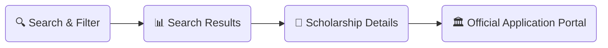
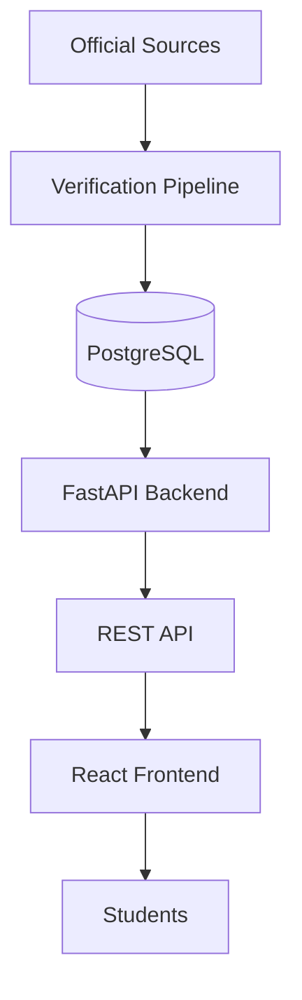

# 🎓 ScholarZone

<p align="center">
  <b>Verified Scholarships. Trusted Information. Better Decisions.</b><br>
  <i>An open-source platform helping students worldwide discover verified scholarships and make informed higher education choices.</i>
</p>

<p align="center">
  
  
  
  
  
</p>

<p align="center">
  
  
  
  
  
  
  
</p>


> 🌐 **Live Demo:** _Coming Soon_  
> 🚧 *Currently under active development.*


---


## Table of Contents

- [Preview](#preview)
- [Problem & Solution](#problem--solution)
- [Features](#features)
- [User Workflow](#user-workflow)
- [Architecture Flow](#architecture-flow)
- [Tech Stack](#tech-stack)
- [Getting Started](#getting-started)
- [Project Structure](#project-structure)
- [Project Status](#project-status)
- [Documentation](#documentation)
- [Contributing](#contributing)
- [Support the Project](#support-the-project)
- [Roadmap](#roadmap)
- [Acknowledgements](#acknowledgements)
- [License](#license)

---

## Preview


> 🚧 Interactive demo and portal screenshots will be available after the Phase 3 frontend milestone.

---

## Problem & Solution

- **The Problem:** Students spend weeks navigating scattered, outdated websites—facing unverified claims, missed deadlines, and broken application links.
- **The Solution:** ScholarZone centralizes verified higher education opportunities into a clean, searchable platform prioritized strictly by primary official sources.

---

## Features

| Feature | Description | Status |
| :--- | :--- | :---: |
| **Verified Scholarship Database** | Government, embassy, and university programs with official direct links | ✅ Available |
| **Precision Search & Filtering** | Filter by country, degree level, target subject, and upcoming deadlines | ✅ Available |
| **Structured Document Checklists** | Comprehensive requirements and document specifications | ✅ Available |
| **University Directory** | Profiles linked directly with eligible programs and available funding | 🚧 In Progress |
| **AI Scholarship Matcher** | Personalized eligibility assessment based on academic profile | 🗓️ Planned |
| **Side-by-Side Comparison** | Compare scholarships, funding, and eligibility requirements | 🗓️ Planned |

---

## User Workflow



---

## Architecture Flow



---

## Tech Stack

| Layer | Technology | Version |
| :--- | :--- | :---: |
| Backend | FastAPI, Python | 3.11+ |
| Frontend | React, Tailwind CSS | 18+ |
| Database | PostgreSQL, SQLAlchemy, Alembic | 15+ |
| Testing | Pytest, React Testing Library | Latest |
| DevOps | Docker, GitHub Actions | Latest |

---

## Getting Started

### Prerequisites

- Python 3.11+
- Node.js 18+
- PostgreSQL 15+
- Git

### Clone Repository

```bash
git clone https://github.com/ScholarZone-org/ScholarZone.git
cd ScholarZone
```

### Backend Setup

```bash
cd backend

python -m venv venv

# Linux / macOS
source venv/bin/activate

# Windows
venv\Scripts\activate

pip install -r requirements.txt

cp .env.example .env

alembic upgrade head
```

### Frontend Setup

```bash
cd ../frontend

npm install
```

### Run Locally

```bash
# Backend
cd backend
uvicorn main:app --reload

# Frontend
cd frontend
npm run dev
```

### API Documentation

Available after running the backend locally:

- Swagger UI → http://localhost:8000/docs
- ReDoc → http://localhost:8000/redoc

---

## Project Structure

```text
ScholarZone/
├── backend/
├── frontend/
├── database/
├── tests/
├── docs/
│   └── assets/
└── README.md
```

---

## Project Status

| Phase | Milestone | Status |
| :--- | :--- | :---: |
| Phase 1 | Architecture & Documentation | ✅ Completed |
| Phase 2 | Backend & Database | 🚧 In Progress |
| Phase 3 | Frontend UI | ⏳ Planned |
| Phase 4 | University Directory | ⏳ Planned |
| Phase 5 | Public Beta | 🗓️ Upcoming |

---

## Documentation

Detailed documentation and technical specifications are located in the `docs/` directory:

- 📘 `docs/architecture.md` — Architecture Overview
- 📘 `docs/api.md` — API Specifications
- 📘 `docs/database.md` — Database Schema
- 📘 `docs/security.md` — Security & Verification

---

## Contributing

We welcome contributions!

Contribution guidelines will be added soon.

---

## Support the Project

If ScholarZone helps you or your academic journey, consider supporting the project:

- ⭐ Star this repository
- 🍴 Fork the repository
- 🐛 Report bugs via GitHub Issues
- 💡 Suggest new features
- 🤝 Contribute through Pull Requests

---


---

## Roadmap

- [x] Project planning
- [x] Repository setup
- [x] Documentation
- [ ] Backend API
- [ ] Database schema
- [ ] React frontend
- [ ] Authentication
- [ ] Scholarship search
- [ ] University directory
- [ ] AI Scholarship Matcher
- [ ] Public Beta Release

---

## Acknowledgements

ScholarZone is built with the goal of making scholarship information more accessible, transparent, and reliable for students worldwide.

Special thanks to every contributor, reviewer, and community member who helps improve the platform by reporting issues, suggesting features, and maintaining accurate scholarship information.

---

<div align="center">

Made with ❤️ for students around the world.

Built with FastAPI • React • PostgreSQL

⭐ If you found this project useful, don't forget to star the repository!

</div>

---

## License

Distributed under the MIT License.

See the **LICENSE** file for details.