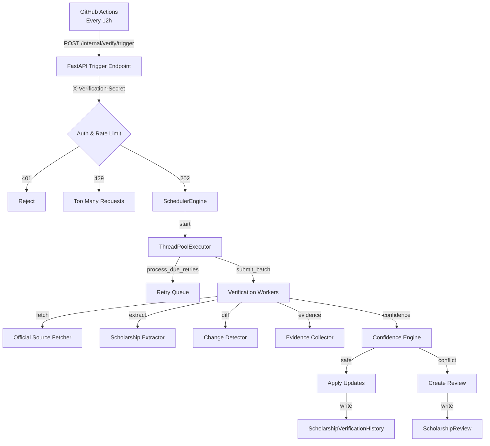
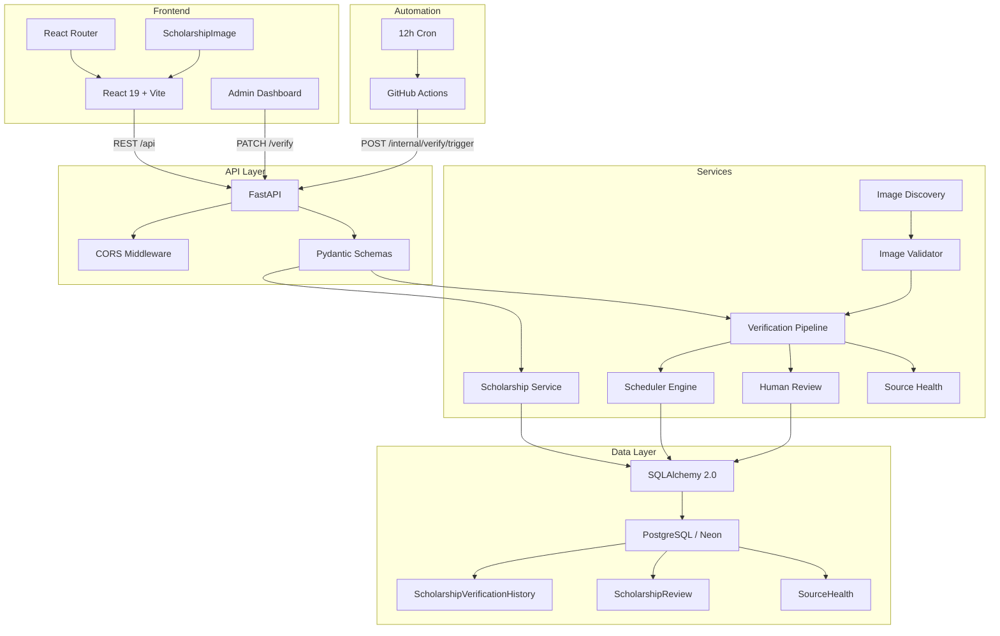

# ScholarZone

<p align="center">
  <b>Verified Scholarships. Trusted Information. Better Decisions.</b><br>
  <i>An open-source platform helping students worldwide discover verified scholarships and make informed higher education choices.</i>
</p>

<p align="center">
  
  
  
  
  
</p>

---

## Table of Contents

- [Problem & Solution](#problem--solution)
- [Core Features](#core-features)
- [Autonomous Verification](#autonomous-verification)
- [Official Image Intelligence](#official-image-intelligence)
- [Architecture](#architecture)
- [Tech Stack](#tech-stack)
- [API Overview](#api-overview)
- [Database](#database)
- [Security](#security)
- [Testing & Quality](#testing--quality)
- [Deployment](#deployment)
- [Project Structure](#project-structure)
- [Current Status](#current-status)
- [Roadmap](#roadmap)
- [Contributing & Development Setup](#contributing--development-setup)
- [License](#license)

---

## Problem & Solution

- **The Problem:** Students spend weeks navigating scattered, outdated websites—facing unverified claims, missed deadlines, and broken application links.
- **The Solution:** ScholarZone centralizes verified higher education opportunities into a clean, searchable platform prioritized strictly by primary official sources.

---

## Core Features

| Feature | Description | Status |
| :--- | :--- | :---: |
| **Scholarship Discovery** | Browse a searchable, paginated directory of verified opportunities | ✅ Available |
| **Filtering & Sorting** | Filter by country, degree, funding, deadline month, and listing status; sort by recommended, recently added, deadline, funding, and name | ✅ Available |
| **Scholarship Details** | Structured view with benefits, eligibility, requirements, documents, application timeline, and official source links | ✅ Available |
| **Verification System** | Field-level verification with active / needs_review / inactive status, last-verified tracking, and next-due scheduling | ✅ Available |
| **Human Review Workflow** | Conflict detection (identity, low confidence, third-party sources) routes uncertain fields to append-only review records with approve/reject flow | ✅ Available |
| **Verification Audit Trail** | Immutable `ScholarshipVerificationHistory` records every field change with old/new values, source URL, confidence, and timestamp | ✅ Available |
| **Official Image Discovery** | Crawls official scholarship source pages (max depth 2) to discover same-domain image candidates with context-aware extraction | ✅ Available |
| **Image Validation** | Layered non-content detection (banners, placeholders, logos, social icons, OG thumbnails), dimension/ratio checks, duplicate detection, and official-domain verification | ✅ Available |
| **Image Persistence** | Authenticated `POST /internal/images/verify` persists HIGH-confidence approved images with idempotent audit history | ✅ Available |
| **Image Fallback** | Frontend `ScholarshipImage` component renders retry logic, broken-image placeholders, and source-type indicators | ✅ Available |
| **Saved Scholarships** | Device-local shortlist with save/unsave actions | ✅ Available |
| **Side-by-Side Comparison** | Compare up to 4 scholarships on country, degree, funding, and deadline | ✅ Available |
- **Country Explorer** | Browse opportunities by destination with live counts and themed editorial cards | ✅ Available |
- **Admin Dashboard** | Glassmorphism control center for verification queue, metric cards, search/filter, and verify/flag actions | ✅ Available |
- **Authentication** | Login and registration pages with `ProtectedRoute` component (defined; route gating not yet applied to admin) | ✅ Available |

---

## Autonomous Verification

ScholarZone runs a structured verification pipeline on a schedule, with safeguards to prevent unsafe data mutations.

### Verification Flow

1. **Trigger:** GitHub Actions cron (every 12 hours) calls the authenticated `POST /internal/verify/trigger` endpoint.
2. **Auth:** The request must include the `X-Verification-Secret` header matching the production `SCHOLARZONE_VERIFICATION_SECRET`.
3. **Rate Limit:** Minimum 60-second interval between triggers; concurrent or rapid requests receive `429 Too Many Requests`.
4. **Engine:** `SchedulerEngine` starts a bounded `ThreadPoolExecutor`, processes due retries, submits a batch of scholarships, waits for completion, then shuts down.
5. **Per-Scholarship:** For each candidate, the pipeline fetches the official source, extracts structured data, diffs against current records, collects evidence, and applies confidence-based safety gates.
6. **Auto-Update vs. Review:**
   - **Auto-update:** Safe, high-confidence changes are applied directly and written to `ScholarshipVerificationHistory`.
   - **Human Review:** Identity conflicts, low-confidence fields, third-party-only evidence, and ambiguous data are routed to `ScholarshipReview` records with `pending` / `approved` / `rejected` states. Reviews are append-only; approval goes through the safe updater in a single transaction.
7. **Persistence:** All changes are committed transactionally. History entries are immutable.

### Scheduler Architecture



### Cloud Cron Configuration

- **Schedule:** `7 */12 * * *` (00:07 and 12:07 UTC daily).
- **Cold-start retry:** Up to 8 attempts with 30s delay, handling `503` (container warming) and connection failures.
- **Idempotency:** Re-running the same verification round does not duplicate history entries for unchanged fields.

---

## Official Image Intelligence

ScholarZone discovers and validates official images using a multi-layered, evidence-driven pipeline. The system never fabricates images—if no trustworthy image is found, none is shown.

### Official Source Resolution

- Each `Scholarship` record stores `official_source_url` and `official_source`.
- `ImageDiscoveryService` crawls same-domain sub-pages (program, application, grant, exchange pages) up to depth 2, max 10 pages per source.
- Candidates are extracted with `ImageCandidate` metadata: URL, page context, alt text, dimensions, and discovery method.

### Layered Non-Content Detection

`ImageValidator` rejects non-content images using weighted evidence across multiple independent detectors:

| Non-Content Class | Detection Signals |
| :--- | :--- |
| **Banners / Hero** | Generic site-wide semantics, oversized dimensions |
| **Placeholders** | Default/empty image filenames, CMS download handlers |
| **Navigation / UI** | Navbar, footer, menu, icon paths |
| **Error Assets** | 404, 500, error placeholder filenames |
| **Logos / Emblems** | Logo, emblem, branding, favicon keywords |
| **Social Icons** | Social share, og-image, twitter-card paths |
| **Generic Hashes** | Long alphanumeric auto-generated filenames |

A candidate is rejected when accumulated evidence weight exceeds `NON_CONTENT_REJECTION_THRESHOLD (1.5)`, regardless of relevance score.

### Confidence & Evidence Workflow

- **HTTP Reachability:** Validates `200 OK` with `image/jpeg`, `image/png`, `image/webp`, `image/svg+xml`, `image/gif`, `image/bmp`, or `image/tiff`.
- **Dimension Gates:** Minimum 200px dimension, 500px for cover candidates, aspect ratio 0.2–5.0.
- **Official Domain Check:** Image domain must match the official source domain or belong to a known `.gov`, `.edu`, `.ac.*`, or approved institutional suffix.
- **Duplicate Detection:** Prevents reusing the same image across unrelated scholarships without provenance evidence.
- **Confidence Levels:** `HIGH` (approved), `MEDIUM` (needs review), `LOW` (rejected), `HUMAN_REVIEW`.

### Live Revalidation & Persistence

- `POST /internal/images/verify` revalidates the candidate using `ImageValidator` at persistence time.
- Requires `HIGH` confidence, `approved` status, and non-content flags to be false.
- Persists only image fields via `ImageVerifier.mark_image_verified()`.
- Creates `ScholarshipVerificationHistory` audit for `NULL -> image` transitions.
- **Idempotent:** Submitting the same image again returns `{"status":"unchanged"}` without duplicate audit records.

### Safe Fallback Behavior

- If `image_url` is missing or fails validation, the database stores `NULL`.
- The frontend `ScholarshipImage` component renders a placeholder SVG for missing images and a broken-image state after retry exhaustion.
- **Quality-first rule:** No trustworthy image = no fabricated image. The system never generates or guesses image URLs.

---

## Architecture



---

## Tech Stack

| Layer | Technology | Version / Notes |
| :--- | :--- | :--- |
| **Frontend** | React | 19.2 |
| | React Router DOM | 7.18 |
| | Vite | 8.2 |
| | Motion (Framer Motion) | 13.1 |
| | ESLint | 10.8 |
| **Backend** | FastAPI | 0.141 |
| | Python | 3.11+ |
| | Uvicorn | 0.52 |
| | SQLAlchemy | 2.0 (>=2.0,<2.1) |
| | Psycopg (v3) | >=3.2,<4 |
| | Pydantic | 2.13 |
| | HTTPX | >=0.27,<0.29 |
| | APScheduler | latest |
| | Resend | latest |
| | python-dotenv | latest |
| **Database** | PostgreSQL (Neon) | Production |
| | SQLite | Development / test |
| **Automation** | GitHub Actions | Cron + workflow_dispatch |
| **Testing** | Pytest | 2101 passing tests |
| **Deployment** | Docker | Multi-stage slim image |
| | Render | Web service (starter plan) |
| **Tooling** | Beautiful Soup | HTML parsing |
| | Pillow | Image dimension validation |

---

## API Overview

| Method | Route | Purpose |
| :--- | :--- | :--- |
| `GET` | `/` | API welcome message |
| `GET` | `/health` | Health check (used by Docker HEALTHCHECK) |
| `GET` | `/scholarships` | List scholarships with filters (`search`, `country`, `degree`, `funding`, `deadline_month`, `status`, `sort`, `page`, `limit`) |
| `GET` | `/scholarships/{id}` | Retrieve full scholarship details |
| `PATCH` | `/scholarships/{id}/verify` | Human verification update (status, notes, reviewer) |
| `GET` | `/scholarships/verification-queue` | List scholarships flagged for review |
| `POST` | `/internal/verify/trigger` | Authenticated trigger for verification round (cloud cron) |
| `GET` | `/internal/verify/status` | Scheduler operational status (unauthenticated) |
| `POST` | `/internal/images/verify` | Authenticated single-image verification and persistence |

### Authentication

- `POST /internal/verify/trigger` and `POST /internal/images/verify` require the header `X-Verification-Secret`.
- Missing or invalid secrets return `401 Unauthorized`.
- `/internal/verify/status` is unauthenticated and returns non-sensitive operational state only.

---

## Database

### Major Entities

| Model | Table | Purpose |
| :--- | :--- | :--- |
| `Scholarship` | `scholarships` | Core scholarship records with official source URLs, verification status, image metadata, eligibility, benefits, requirements, and documents |
| `ScholarshipVerificationHistory` | `scholarship_verification_history` | Append-only field-level audit trail (old/new values, source URL, confidence, timestamp) |
| `ScholarshipReview` | `scholarship_reviews` | Human review queue for conflicts (identity, low confidence, third-party sources) with approve/reject decisions |
| `ScholarshipFetchAttempt` | `scholarship_fetch_attempts` | Retry state and telemetry for official source fetches |
| `ApprovedSource` | `approved_sources` | Whitelisted official source domains with trust scores and discovery patterns |
| `SourceHealth` | `source_health` | Per-domain reliability metrics (success/failure counts, latency, reliability score, health status) |
| `ScholarshipSnapshot` | `scholarship_snapshots` | Temporal versioning snapshots for rollback and provenance |
| `DiscoveryCandidate` | `discovery_candidates` | Raw discovered scholarship candidates before matching and ingestion |
| `ScholarshipRestoreRecord` | `scholarship_restore_records` | Operational audit for restore actions |
| `ContentFingerprintRecord` | `content_fingerprints` | Content hashes for change detection and staleness governance |
| `KnowledgeNode` / `KnowledgeEdge` | `knowledge_nodes` / `knowledge_edges` | Knowledge graph for entity resolution and relationship tracking |

### Production Configuration

- **Production:** PostgreSQL on Neon (free tier). `SCHOLARZONE_DATABASE_URL` must be set to a `postgresql://` connection string. SQLite is explicitly rejected in production.
- **Development / Test:** SQLite (`backend/scholarzone.db`) is used by default when `SCHOLARZONE_DATABASE_URL` is unset. Test isolation is enforced: tests cannot accidentally connect to the production SQLite file.

---

## Security

| Mechanism | Implementation |
| :--- | :--- |
| **Authenticated Internal Trigger** | `POST /internal/verify/trigger` and `POST /internal/images/verify` require `X-Verification-Secret` header matching `SCHOLARZONE_VERIFICATION_SECRET` |
| **Secret Handling** | Secret is read from environment variables only. `.env` is git-ignored. Render generates the secret via `generateValue: true`. GitHub Actions stores it in repository secrets |
| **Rate Limiting** | 60-second minimum interval between verification triggers (in-memory, per-process). Cloud cron controls frequency |
| **Production DB Guard** | `SCHOLARZONE_ENVIRONMENT=production` rejects SQLite URLs and requires `SCHOLARZONE_DATABASE_URL` |
| **Safe Persistence** | Image persistence rejects `HUMAN_REVIEW` / `REJECTED` status, non-content images, and non-HIGH confidence. No fabricated images are ever written |
| **CORS** | Restricted to configured `SCHOLARZONE_ALLOWED_ORIGINS` (defaults to localhost dev ports). Swagger/ReDoc docs are disabled in production |

> **Note:** Never commit `.env`, secrets, tokens, or database credentials to the repository.

---

## Testing & Quality

| Category | Status |
| :--- | :--- |
| **Backend Tests** | 2101 passing (`pytest`) |
| **Test Isolation** | In-memory SQLite enforced for `SCHOLARZONE_ENVIRONMENT=test`; production DB access blocked |
| **Coverage Areas** | Verification pipeline, image discovery/validation, scheduler safety, human review, evidence arbitration, confidence decay, anomaly detection, knowledge graph, telemetry, temporal versioning, source health, database driver, and integration audits |

Run tests locally:

```bash
cd backend
python -m pytest tests/ -x --tb=short
```

---

## Deployment

| Component | Platform | Configuration |
| :--- | :--- | :--- |
| **API** | Render.com (Docker) | `backend/Dockerfile`, `render.yaml` |
| **Database** | Neon (PostgreSQL) | Free tier, connection via `SCHOLARZONE_DATABASE_URL` |
| **Automation** | GitHub Actions | `7 */12 * * *` cron + `workflow_dispatch` |
| **Health Check** | Render | `/health` endpoint, 30s interval |
| **Startup** | `start.sh` | Validates DB URL, initializes schema, starts Uvicorn |

### GitHub Actions Automation

- **Workflow:** `.github/workflows/verification-cron.yml`
- **Trigger:** Schedule (every 12 hours) and manual `workflow_dispatch`.
- **Behavior:** Validates `SCHOLARZONE_API_URL` and `SCHOLARZONE_VERIFICATION_SECRET`, then POSTs to `/internal/verify/trigger` with up to 8 retry attempts for cold-start resilience.
- **Responses Accepted:** `202 Accepted` (success), `429 Too Many Requests` (already running).

---

## Project Structure

```
ScholarZone/
├── backend/
│   ├── app/
│   │   ├── __init__.py
│   │   ├── core/
│   │   │   ├── __init__.py
│   │   │   └── config.py
│   │   ├── data/
│   │   │   ├── __init__.py
│   │   │   ├── verified_scholarships.py
│   │   │   ├── additional_scholarships.py
│   │   │   └── ...
│   │   ├── database.py
│   │   ├── main.py
│   │   ├── models.py
│   │   ├── schemas.py
│   │   ├── seed.py
│   │   ├── scheduler_v2.py
│   │   ├── routers/
│   │   │   ├── __init__.py
│   │   │   ├── scholarships.py
│   │   │   └── verification.py
│   │   └── services/
│   │       ├── image_discovery.py
│   │       ├── image_validator.py
│   │       ├── scholarship_image_verifier.py
│   │       ├── scholarship_verifier.py
│   │       ├── scholarship_review.py
│   │       ├── scheduler_engine.py
│   │       ├── scheduler_queue.py
│   │       ├── source_health_service.py
│   │       ├── telemetry.py
│   │       └── ...
│   ├── tests/
│   │   ├── conftest.py
│   │   ├── test_scholarships.py
│   │   ├── test_scholarship_images.py
│   │   ├── test_internal_image_verify.py
│   │   └── ...
│   ├── Dockerfile
│   ├── requirements.txt
│   ├── render.yaml
│   └── start.sh
├── frontend/
│   ├── src/
│   │   ├── components/
│   │   │   ├── ScholarshipImage.jsx
│   │   │   ├── ScholarshipCard.jsx
│   │   │   ├── ScholarshipList.jsx
│   │   │   ├── ScholarshipActions.jsx
│   │   │   ├── Layout.jsx
│   │   │   ├── Navigation.jsx
│   │   │   ├── ScholarZoneHero.jsx
│   │   │   └── ...
│   │   ├── pages/
│   │   │   ├── HomePage.jsx
│   │   │   ├── ScholarshipsPage.jsx
│   │   │   ├── ScholarshipDetailsPage.jsx
│   │   │   ├── CountryPage.jsx
│   │   │   ├── SavedScholarshipsPage.jsx
│   │   │   ├── ComparePage.jsx
│   │   │   ├── AdminPage.jsx
│   │   │   ├── LoginPage.jsx
│   │   │   └── RegisterPage.jsx
│   │   ├── services/
│   │   │   └── scholarshipService.js
│   │   ├── hooks/
│   │   ├── context/
│   │   ├── data/
│   │   └── utils/
│   ├── package.json
│   ├── vite.config.js
│   └── index.html
├── docs/
│   ├── SCHOLARSHIP_INGESTION.md
│   └── ...
└── README.md
```

---

## Current Status

### Production / Live Features

- FastAPI backend with public scholarship directory and authenticated verification endpoints.
- React frontend with full scholarship discovery, detail view, search/filter/sort, saved scholarships, comparison, country explorer, and admin verification dashboard.
- Image discovery, validation, and persistence pipeline with layered non-content detection.
- Autonomous verification triggered by GitHub Actions every 12 hours.
- Human review workflow for low-confidence or conflicted fields.
- PostgreSQL/Neon production database with comprehensive audit trails.

### Completed Systems

- Verification pipeline with evidence collection, confidence assessment, and safety gates.
- Image intelligence pipeline (discovery → validation → persistence → audit).
- Scheduler engine with bounded concurrency, retry orchestration, and transaction-safe shutdown.
- Source health monitoring and adaptive fetch policies.

---

## Roadmap

| Item | Status |
| :--- | :--- |
| **AI Scholarship Matcher** | Planned — personalized eligibility assessment based on academic profile |
| **University Directory** | Planned — profiles linked directly with eligible programs and funding |
| **Email Notifications** | In progress — Resend integration for verification reminders |
| **Public Beta Launch** | Upcoming |

---

## Contributing & Development Setup

### Prerequisites

- Python 3.11+
- Node.js 18+
- PostgreSQL 15+ (or use included SQLite for local development)
- Git

### Clone Repository

```bash
git clone https://github.com/ScholarZone-org/ScholarZone.git
cd ScholarZone
```

### Backend Setup

```bash
cd backend

python -m venv venv

# Linux / macOS
source venv/bin/activate

# Windows
venv\Scripts\activate

pip install -r requirements.txt

cp .env.example .env
# Edit .env with your values
```

### Frontend Setup

```bash
cd frontend
npm install
```

### Run Locally

```bash
# Backend (from backend/)
uvicorn app.main:app --reload

# Frontend (from frontend/)
npm run dev
```

### Environment Variables

| Variable | Purpose | Required |
| :--- | :--- | :--- |
| `SCHOLARZONE_ENVIRONMENT` | `development` (default), `production`, or `test` | No |
| `SCHOLARZONE_DATABASE_URL` | PostgreSQL connection string in production; SQLite fallback in dev | Production only |
| `SCHOLARZONE_ALLOWED_ORIGINS` | Comma-separated CORS origins | No |
| `SCHOLARZONE_VERIFICATION_SECRET` | Shared secret for `/internal/verify/trigger` and `/internal/images/verify` | Production recommended |
| `RESEND_API_KEY` | API key for email notifications | No |
| `NOTIFICATION_EMAIL` | Sender address for notifications | No |

> **Note:** In production, `SCHOLARZONE_DATABASE_URL` must point to PostgreSQL (Neon). SQLite is never used as a fallback in production.

### API Documentation

Available after running the backend locally:

- Swagger UI → `http://localhost:8000/docs`
- ReDoc → disabled in production

---

## License

Distributed under the MIT License.
See the **LICENSE** file for details.
# CI trigger

